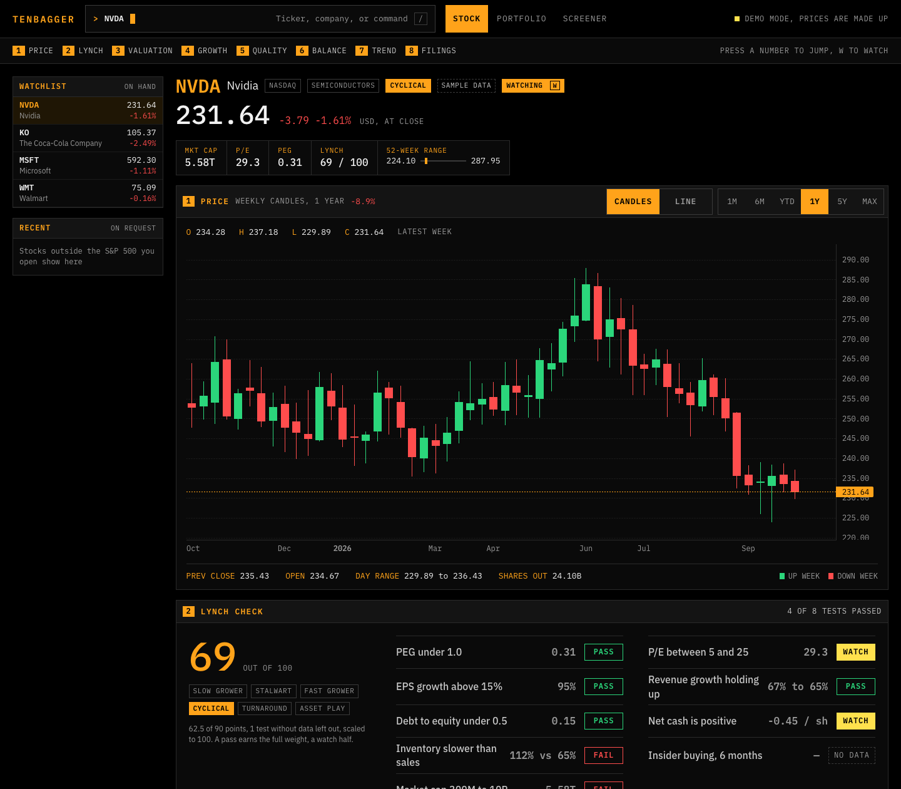
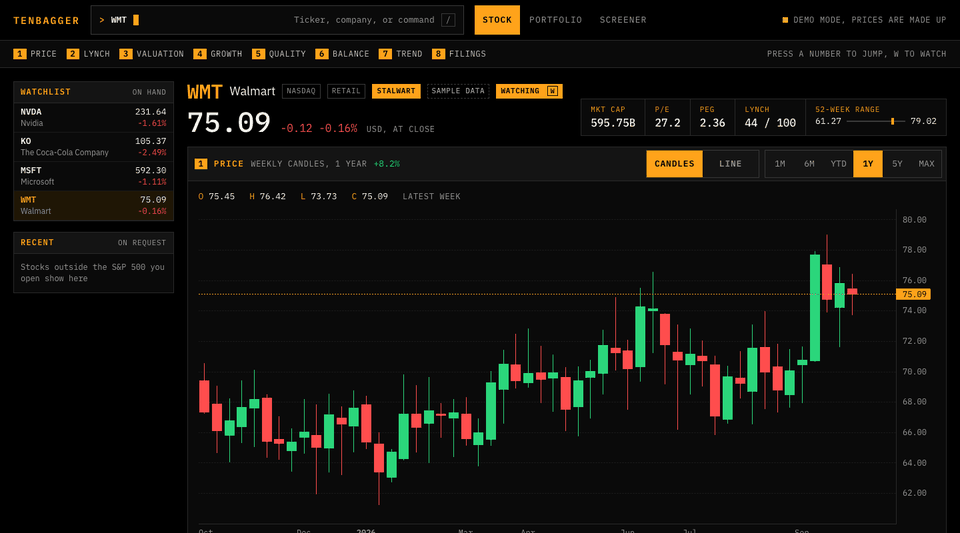
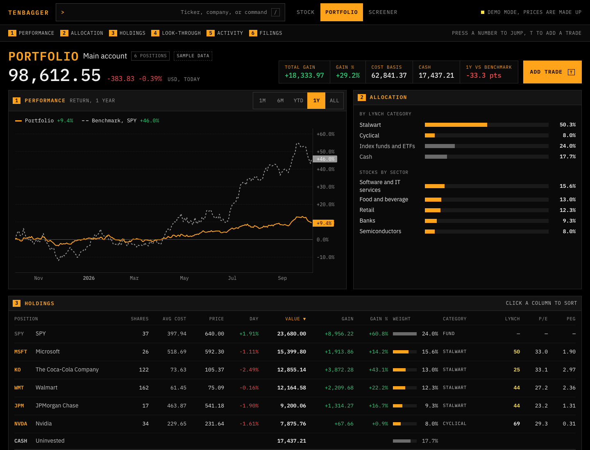
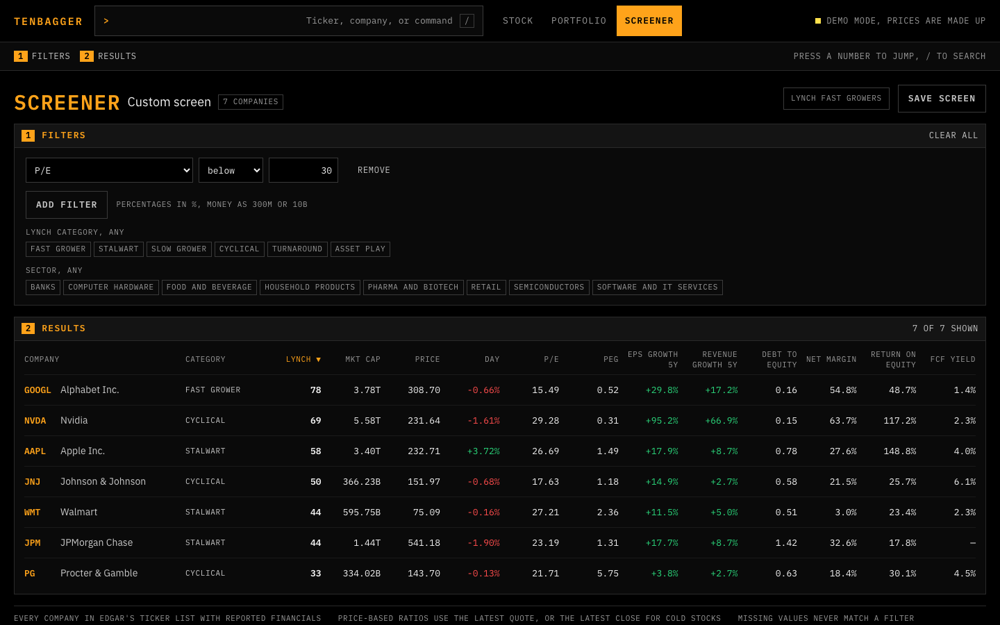

# Tenbagger

A local stock research app that opens any US stock in under a second and shows every key ratio on one screen, built entirely on free data. Fundamentals for about 8,000 companies come straight from SEC EDGAR filings and live in a local SQLite database, so opening a stock never waits on a data provider; the only live call is its price. Every stock gets a Peter Lynch style check: one of his six categories and a score out of 100 from nine tests, each traceable to its inputs. It also tracks a personal portfolio, and screens the whole market in milliseconds.

**This is a research tool, not investment advice.**



Search opens with `/`, matches as you type, and opens with Enter:



<sub>Screenshots use demo mode: real EDGAR fundamentals with made-up prices.</sub>

## Quick start

Try it with no keys, on bundled sample data (Python 3.12+ and Node 20+):

```bash
git clone https://github.com/ericpeck05/tenbagger && cd tenbagger
make demo
```

That opens http://localhost:5174 with ten companies, made-up prices, and a made-up portfolio.

To run it on real data:

1. `cp .env.example .env`, then fill in `SEC_USER_AGENT` (your name and contact email, which EDGAR requires) and free keys from [Finnhub](https://finnhub.io) and [Alpaca](https://alpaca.markets).
2. `make bulk` loads every listed US company from EDGAR's bulk files (a 3 GB download, deleted afterwards, under 10 minutes).
3. `make dev` starts the app at http://localhost:5173. Quotes, price history, new filings, insider trades, and sector medians then keep themselves current in the background.

You also need [`gitleaks`](https://github.com/gitleaks/gitleaks) (`brew install gitleaks`) if you plan to commit; a pre-commit hook blocks secrets.

## What's in it

- **Stock page.** A full-width candlestick chart, the Lynch check, valuation, growth, quality, and balance sheet ratios, each placed inside the stock's own 5-year range and against its sector median, a 10-year revenue and EPS trend, and the latest filings. Number keys jump between panels.
- **Search.** `/` from anywhere. Ticker prefix first, then company name.
- **Portfolio.** A hand-entered trade log (stored only on your machine). Shares, average cost, and cash are derived from it; returns are time-weighted against SPY; a look-through panel treats your stocks as one company.
- **Screener.** Filter and sort every company on any ratio, sector, or Lynch category. Ships with a "Lynch fast growers" preset.





## How it works

```
            Browser UI (React app at localhost)
                        |
                        |  JSON over localhost
                        v
  +--------------------- runs on the Mac ----------------------+
  |                                                            |
  |   API server  --reads-->  SQLite database  <--writes--  Fetcher
  |   (FastAPI)                                      (rate-limited adapters)
  |        |                                              ^    |
  |        +------------- on a cache miss ----------------+    |
  +------------------------------------------------------------+
                                                          |
                 +----------------------+-----------------+
                 v                      v                 v
            SEC EDGAR                 Alpaca           Finnhub
     fundamentals and filings    daily price bars   current quotes
```

Ratios are computed locally from raw XBRL facts: tags are mapped to metrics, trailing twelve months are built from 10-K and 10-Q periods, and stock splits are restated. [`SPEC.md`](SPEC.md) has the full design, the tag map, the formulas, and the known gaps in free data.

## Data sources

| Job | Provider | Limit |
| --- | --- | --- |
| Fundamentals, filings, insider trades | [SEC EDGAR](https://www.sec.gov/search-filings/edgar-application-programming-interfaces) | 10 requests per second; a User-Agent with a contact email is required |
| Daily price history | [Alpaca](https://alpaca.markets) Basic, SIP feed | 200 calls per minute; history since 2016; requests must end 15 minutes ago |
| Current quotes | [Finnhub](https://finnhub.io) free tier | 60 calls per minute |

The app stays under each limit (8 per second, 150 and 50 per minute). EDGAR data is free to reuse. Finnhub and Alpaca data are for personal use: they stay on your machine and are never committed to this repo, which is why the screenshots use made-up prices.

## Commands

| Command | Does |
| --- | --- |
| `make demo` | Run on bundled sample data, no keys (`make demo-reset` rebuilds it) |
| `make dev` | Run on your data at http://localhost:5173 |
| `make bulk` | Load every listed US company from EDGAR's bulk files |
| `make load` | Load just the S&P 500 through EDGAR's per-company API |
| `make filings` | Pick up new filings now (the app also does this twice a day) |
| `make coverage` | Report how many S&P 500 companies resolve each metric |
| `make test`, `make lint` | Tests (including ten companies checked against their 10-Ks) and linters |

Charting by [TradingView Lightweight Charts](https://www.tradingview.com/lightweight-charts/).

## License

MIT
